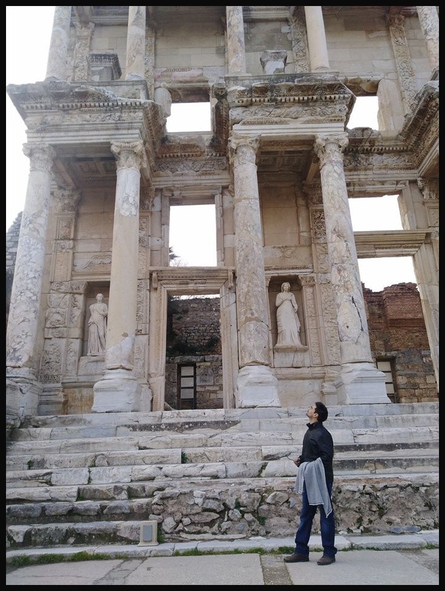

# 🖼️ TC1001S Python Image Filter Project

This repository showcases a Python-based image filtering tool that demonstrates how to apply convolution and padding techniques to process and manipulate images. It is designed for educational purposes and can be expanded for more advanced image processing tasks.

---

## 🚀 Features

- **Customizable Filtering Logic** – Easily modify the kernel and filtering approach.
- **Clear & Well-Documented Code** – Ideal for learning or extending for personal projects.
- **Multiple Image Processing Techniques** – Includes convolution and padding.
- **Lightweight Dependencies** – Minimal setup with commonly used libraries.

---

## 📦 Requirements

- Python 3.8 or higher
- Required libraries:
  - `numpy`
  - `opencv-python` (`cv2`)
  - `matplotlib`

---

## 🔧 Installation

1. **Clone this repository**
   ```bash
   git clone https://github.com/AntonioJCB/TC1001S.git

## Casos de prueba

### Convolution
- Entrada  
  

- Salida  
  

### Padding
- Entrada  
    
  constant  
  10  
  10  
  10  

- Salida  
    
